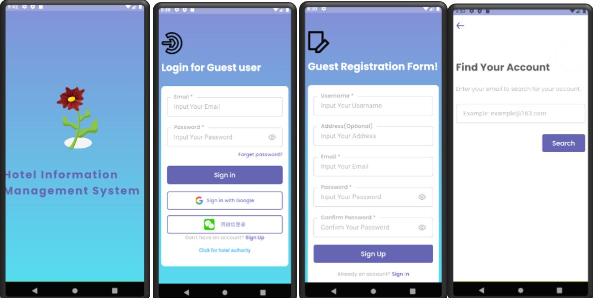
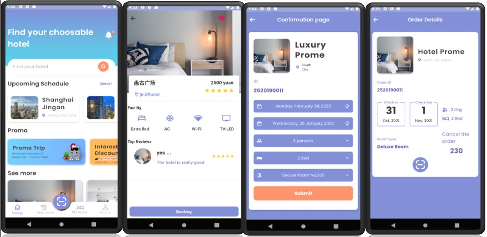
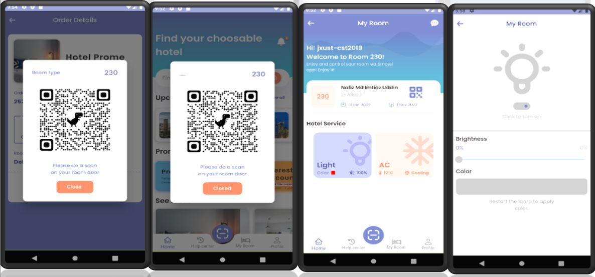
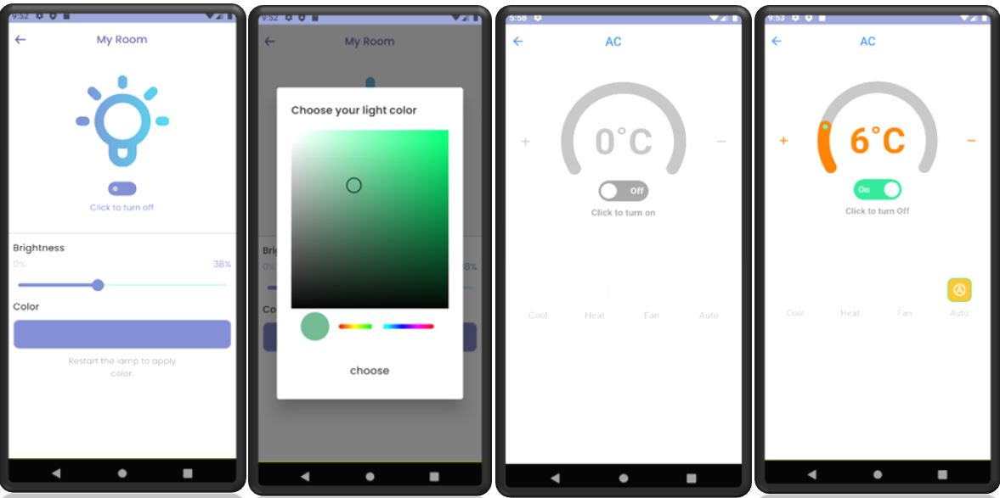
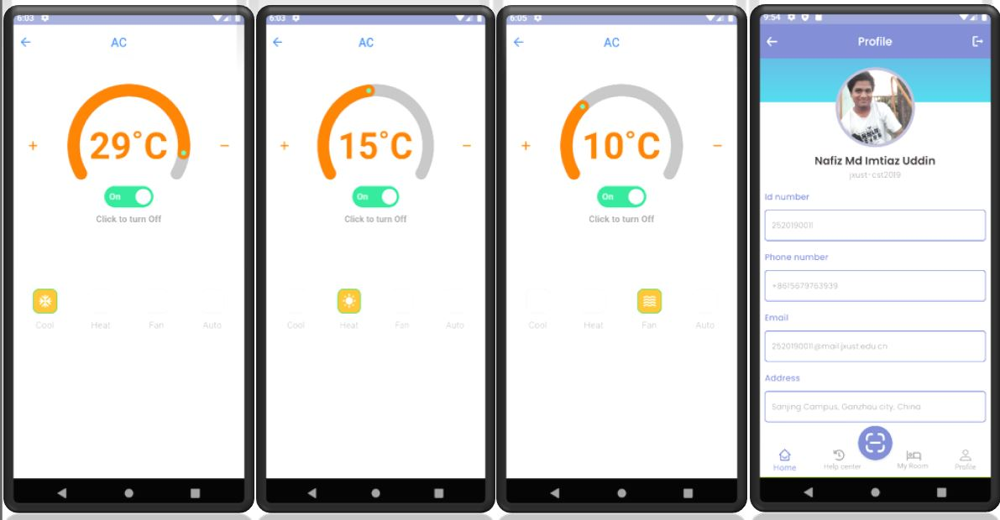

For APK file:
------------
------------

I used ............

- IDE Version: Android Studio 4.0.1
- Android Emulator: Pixel 3a API 28  
- Resolution – 1080 x 2220: 440dip
- Target: Android 9.0
- CPU- x86
------------

### Here is inclued some screenshots:

...............................
...............................

## [See more details...](https://www.slideshare.net/NafizMdImtiazUddin/flutterdart-project-hotel-management-system)

